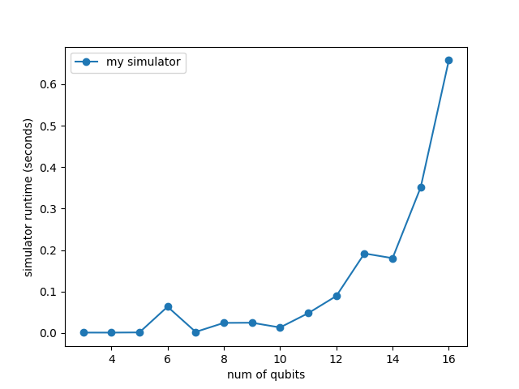
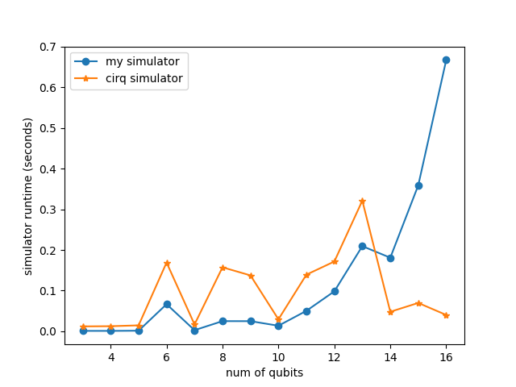

# Report of Implement a quantum circuit simulator

* [1. Design and evaluation](#1-design-and-evaluation)
  * [Present the design of how you parameterized the solution in n](#present-the-design-of-how-you-parameterized-the-solution-in-n) 
  * [Discuss your effort to test your simulator and present results from the testing](#discuss-your-effort-to-test-your-simulator-and-present-results-from-the-testing)
  * [Present a diagram that maps n to execution time](#what-is-your-experience-with-scalability-as-n-grows-present-a-diagram-that-maps-n-to-execution-time)
* [2. Instructions](#2-instructions)
  * [how to provide input](#how-to-provide-input) 
  * [how to run the program](#how-to-run-the-program)
  * [how-to-understand-the-output](#how-to-understand-the-output)


## Highlight

- **Particularly comprehensive evaluation and testing**: The test includes not only the correctness on the benchmark but also the performance, i.e. the execution time compared to the cirq simulator for the same benchmark, as well as custom additional test cases. More details are as follow.
- **Interesting finding**: Intuitively, the running time of the simulator should increase with the num of qubits grow, and the simulator I implemented also meets this expectation. But when I check running time of original cirq simulator, it seems that the number of operations (qasm lines) have more impact on running time than num of qubits. So I also performed ablation study to fix num of qubits and numb of operations (gates) respectively, to verify this finding. More details are as follow.
- **Speed up tips**: Implement each gate with bit manipulation to the target and control qubit rather than original matrix multiplication. For example, in order to identify whether the k^th qubit is 0 or 1 in the i^th entry of the state vector, just call 2^(n-k-1) & i. More details are in code.
- **Code well designed for improved usability or ease of understanding**: The code structure is very clear, including Simulator class (`__init__(self, n)`, `operation(self, gate, target, control=None)`, `run(self, circuit)`, `state_vector(self)`) and `parse_qasm(qasm_string)`, and a preprocessing function `get_num_qubits(qasm_string)` to get how many qubits that actually need. More details are as follow.
- **Vivid diagram display**: Plot diagrams of the execution time as the input n changes, which can show the results more clearly and intuitively.


## Usage

Simply run `python3 compare_simulators.py qasm_files` to test correctness for grading, run `python3 test_simulators.py qasm_files` to test correctness and performance compared with cirq simulator, while `qasm_files` is the directory name of your qasm files.

Recommendation: using `conda` to create a virtual environment to run the code so that it doesn't interfere with the other environment.

```
conda create --name cs238 python=3.8
conda activate cs238
pip install cirq
pip install numpy
pip install ply
```


# 1. Design and evaluation

## Present the design of how you parameterized the solution in n

Initialize `Simulator` with parameterized $n$, where $n$ is num of qubits, which is through preprocessing qasm file to get how many qubits that actually need. The `simulate` function takes in a qasm-formatted string and returns a list. The length of list is $2^n$, with each index containing a complex number for each of the $2^n$ possible amplitudes.

```python
def simulate(qasm_string):
    """
    simulate function on the qasm string to compare the results with cirq simulator
    :param qasm_string: qasm-formatted string
    :return: state_vector list
    """
    # preprocessing qasm_string to get how many qubits that actually need
    num_qubits = get_num_qubits(qasm_string)
    # parse qasm_string to generate circuit operation list
    circuit = parse_qasm(qasm_string)
    # initialize simulator with num of qubits
    my_simulator = Simulator(num_qubits)
    # run my simulator to execute the operations in order
    my_simulator.run(circuit)
    # return state_vector list, with a complex number for
    # each of the 2^num_qubits possible amplitudes
    state = my_simulator.state_vector()
    return state
```

## Discuss your effort to test your simulator and present results from the testing

The test benchmark includes 14 programs from a subset of QASM, measuring results include correctness and performance. Just run `python3 test_simulators.py qasm_files`, while `qasm_files` is the directory name of qasm files. The program will output: 1). testing bechmark file_name; 2). my simulator runtime; 3). cirq simulator runtime; 4). testing results correctness (compared with cirq simulator). At last, the program also output the accuracy in all test benchmarks. Such as:

```
qasm_files/cnt3-5_179.qasm
my simulator finished in 0.6671221256256104 seconds
cirq simulator finished in 0.040255069732666016 seconds
True

qasm_files/wim_266.qasm
my simulator finished in 0.0503697395324707 seconds
cirq simulator finished in 0.13927602767944336 seconds
True

Total 14 benchmark, 14 are correct, grade is 100.00%!

```

## What is your experience with scalability as n grows? Present a diagram that maps n to execution time

For my impletented simulator, when n is less than 10, the execution time has little variation. As n grows further, the execution time increases almost exponentially , as is shown in the below figure:


Interestingly, I also checked execution time of cirq simulator, it seems that the number of operations (qasm lines) have more impact on running time than num of qubits, as is shown in the below figure:


Therefore, I did an ablation study of how running time with the increasing number of operations. To isolate this factor, I create a custom qasm file that keeps the number of gates fixed, simply increase the number of qubits and then perform the time analysis with scalability as n grows. It validates this observation and normally increases with n grows as expected.


# 2. Instructions

## how to provide input

The input is qasm-formatted string, then parse qasm_string to generate circuit operation list, next initialize simulator with num of qubits and run my implemented simulator to execute the operations in order. At last, return state_vector list, with a complex number for each of the 2^num_qubits possible amplitudes.

## how to run the program

Simply run `python3 compare_simulators.py qasm_files` to test correctness for grading, run `python3 test_simulators.py qasm_files` to test correctness and performance compared with cirq simulator, while `qasm_files` is the directory name of your qasm files.

## how to understand the output

The output is state_vector list, the length of list is $2^n$, with each index containing a complex number for each of the $2^n$ possible amplitudes. The indices use big endian ordering for the qubits from reference: https://quantumai.google/reference/python/cirq/sim/StateVectorTrialResult#state_vector

